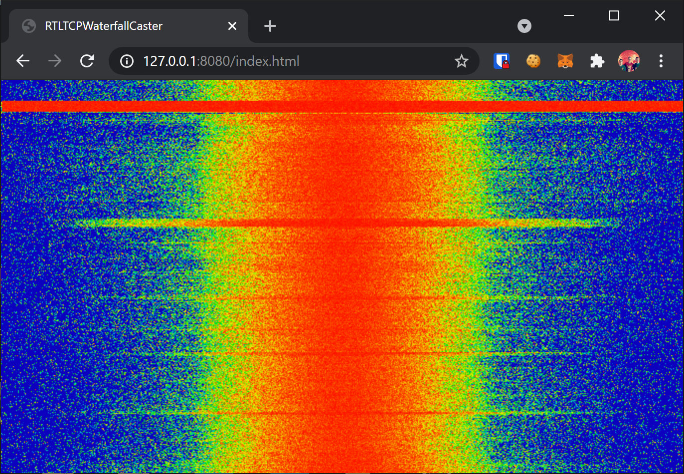

# RTLTCPWaterfallCaster

A Node.js application that takes in a [rtl_tcp](https://osmocom.org/projects/rtl-sdr/wiki/Rtl-sdr#rtl_tcp) stream and converts it into a (relatively) lightweight frequency waterfall only WebSocket stream. It does this by performing a fast Fourier transform and lossy compression.

## Screenshot

